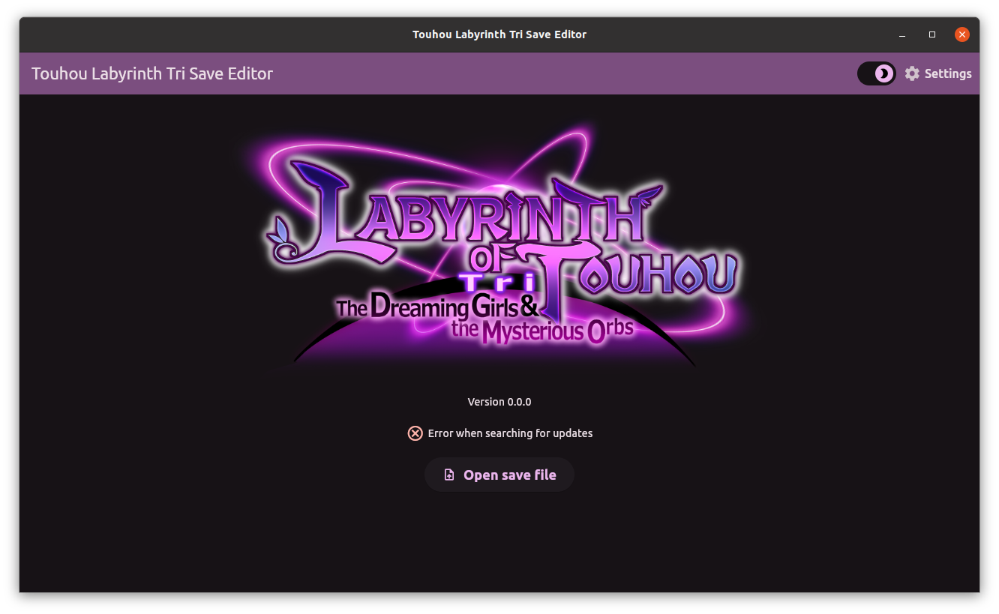
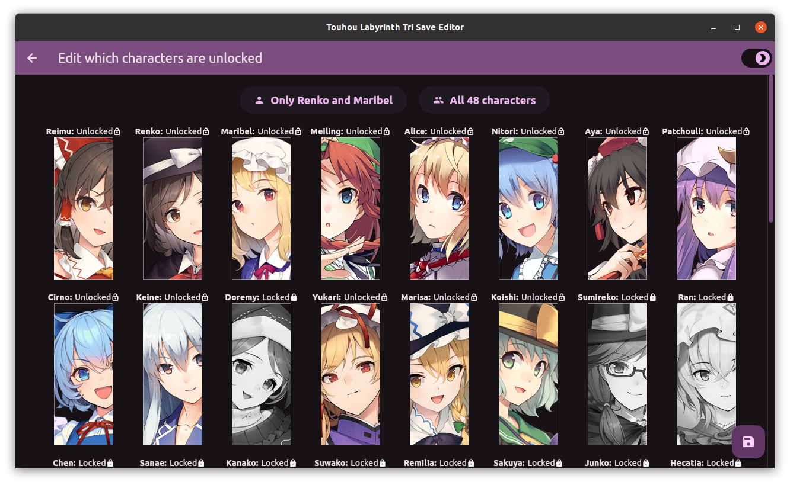
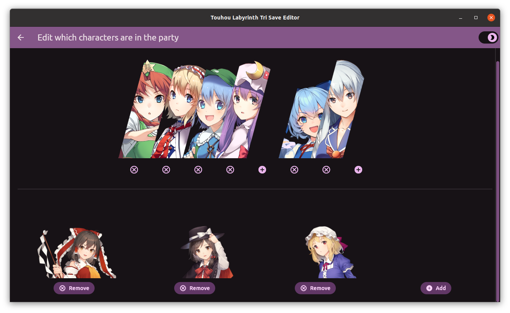

# Touhou Labyrinth Tri Save Editor

This repository provides a save editor for Touhou Labyrinth Tri, capable of editing many of the event flags and character stats in your save file, among other things. Unlike editing a raw hex file, which would require computing the correct offsets and hexadecimal convertions, this program aims to provide an intuitive interface for each piece of data in the save file:

## Supported Platforms

Windows and Linux binaries are provided in the [Releases page](https://github.com/Thurler/thlaby3-save-editor/releases) page, and should work out of the box. A Mac build is not provided since I do not own a Mac, and have no idea how to build and test a release without one. Please follow the [Flutter install instructions](https://docs.flutter.dev/get-started/install) if you are using a Mac or want to compile the software yourself.

## Features and Roadmap

- Current release (0.1.0)
  - Edit character unlock flags
  - Edit which characters are in the party
  - Logging for debugging purposes
  - Automatic update checking
- Version 0.2.0
  - Edit some character parameters
    - Level, EXP, BP
    - Library points
    - Level bonuses
    - Shrine item investments
- Version 0.3.0
  - Edit more character parameters
    - Learned skills
- Version 0.4.0
  - Edit inventory unlock flags and amount
  - Edit more character parameters
    - Equipment
- Version 0.5.0
  - Edit general data (money amount, play time, difficulty, etc)
- Version 0.6.0
  - Edit achievement data
- Version 0.7.0
  - Edit map data
- Version 0.8.0
  - Edit bestiary data
- Version 0.9.0
  - Edit event flags (dungeon events, story events, etc)
- Version 1.0.0
  - Multi-language support
- Not currently planned
  - MacOS support
  - Translation to languages not supported in-game
  - Add more in-game validation checks
    - Changing library points changes current money
    - Changing shrine items changes current item amounts
    - Changing equipment changes current item amounts

## Contributing

If you have found a problem with the software, please open an issue and describe the problem - give as much information as you can so I can reliably replicate the problem! That might include sharing log files or the save file being used when the problem happened.

If you would like to contribute to the code base, feel free to open a Pull Request with your proposed changes and ask for a review. The code is formatted using [this tool](https://github.com/Thurler/dart_style) instead of Dart's standard one, since it more closely matches my subjective takes on formatting.

## Disclaimers

This software is a hobby project. The author provides this software with no warranty whatsoever. Always be careful when editing save files that are precious to you. ALWAYS BACKUP YOUR FILES BEFORE EDITING THEM!
